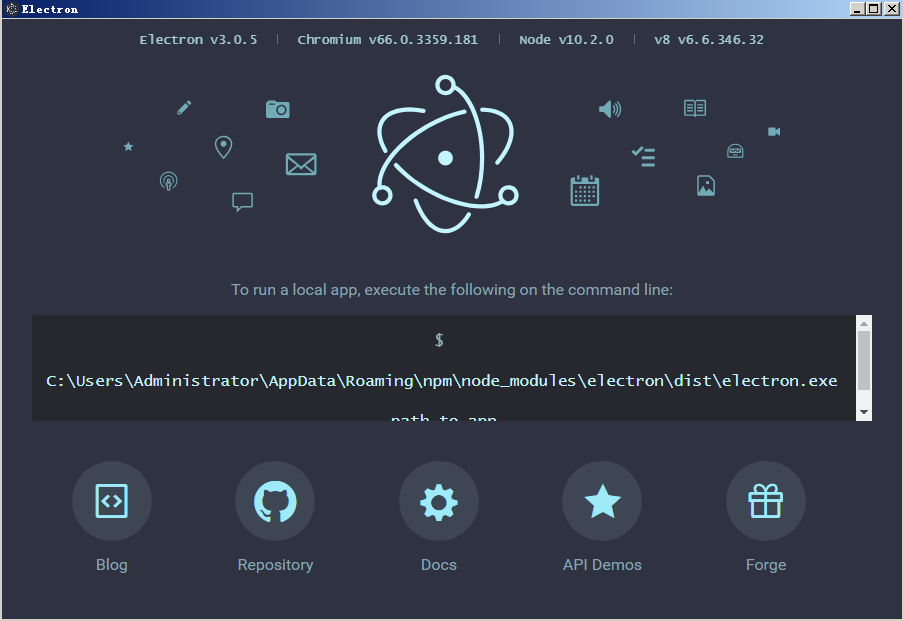

```cmd
G:\nodeproject\electron>npm install electron -g
C:\Users\Administrator\AppData\Roaming\npm\electron -> C:\Users\Administrator\AppData\Roaming\npm\node_modules\electron\cli.js

> electron@3.0.5 postinstall C:\Users\Administrator\AppData\Roaming\npm\node_modules\electron
> node install.js

Downloading tmp-6504-1-SHASUMS256.txt-3.0.5
[============================================>] 100.0% of 4.74 kB (4.74 kB/s)
+ electron@3.0.5
added 144 packages in 283.193s


   ╭─────────────────────────────────────╮
   │                                     │
   │   Update available 5.5.1 → 6.4.1    │
   │     Run npm i -g npm to update      │
   │                                     │
   ╰─────────────────────────────────────╯
G:\nodeproject\electron>electron

```

接下来会打开一个electrno的界面



开发一个electron桌面应用

1) package.json: 用于配置Electron工程的
2) index.js: 相当于Electron桌面应用的入口
3) index.html: 用于主窗口UI的页面文件

